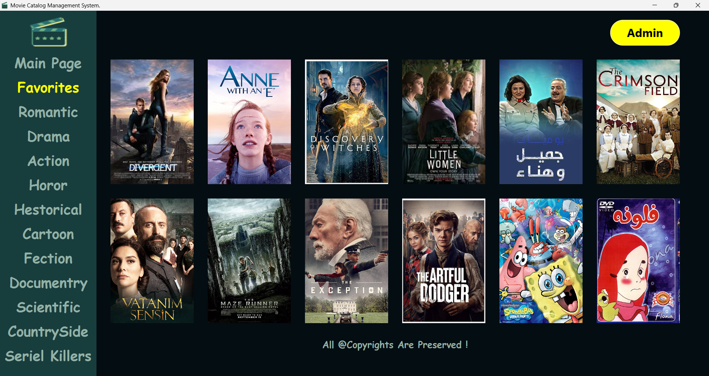
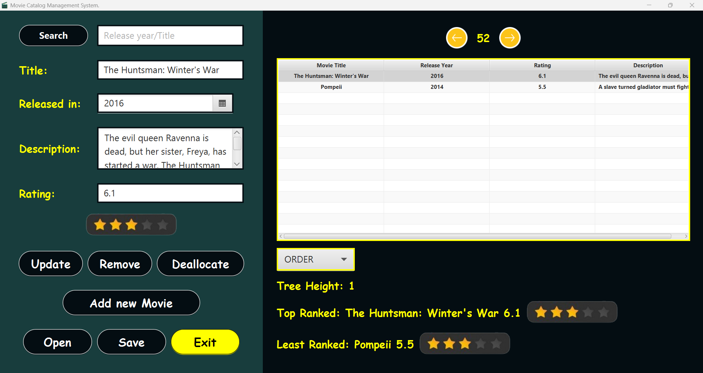

# 🎬 Movies Catalog Management System

A Java desktop application for managing and analyzing a movie catalog using **custom data structures** — built with JavaFX for an interactive experience.
Each movie is hashed based on its title and stored in a specialized data structure: a **hash table where each cell is an AVL tree**.

## 📦 Core Features

- **Movie Hashing System**  
  Movies are hashed using their title and placed into one of the hash table’s cells.  
  Each cell contains a **custom AVL tree** storing movies in a balanced way.

- **AVL Tree Operations**  
  - Self-balancing insertions
  - Tree height display
  - Retrieve **best-rated** and **worst-rated** movies in each tree

- **Star Rating View**  
  Each movie's rating is visually represented with star graphics in the JavaFX UI.

- **Custom Data Structures**  built from scratch.
  - `HashTable` with AVL tree chaining  
  - `AVLTree` 
  - `SinglyLinkedList` for auxiliary data handling

## 🧰 Tech Stack

- **Language**: Java  
- **UI Framework**: JavaFX  
- **Custom DS**: AVL Tree, Singly Linked List, Hash Table  
- **App Type**: Desktop Application

## 🎯 Use Case

Built for cataloging, storing, and rating movies in an efficient way. 
Ideal for learning advanced data structures and exploring real-world use of hashing and balancing trees in a user-friendly environment.

## 📸 Screenshots

<!-- Replace these paths with actual images once uploaded -->




## ⚙️ How to Run

1. Clone the repo:
   ```bash
   git clone https://github.com/yourusername/movie-catalog-system.git
